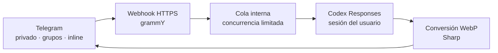

<div align="center">

# 🎨 StickerGen

**Convierte una idea —o una foto— en un sticker de Telegram usando tu propia cuenta de Codex.**

[](https://t.me/stickergen_miramacho_bot)
[](https://nodejs.org/)
[](https://grammy.dev/)
[](https://www.docker.com/)

### [🚀 Abrir @stickergen_miramacho_bot](https://t.me/stickergen_miramacho_bot)

</div>

StickerGen enlaza cada usuario de Telegram con su propia sesión de OpenAI/Codex, genera imágenes y las entrega como stickers estáticos compatibles con Telegram. Funciona en privado, dentro de grupos y mediante el modo inline, incluso cuando el bot no pertenece al chat.

> [!NOTE]
> Este es un proyecto independiente. No está afiliado con Telegram ni con OpenAI.

## ✨ Qué puede hacer

| | Funcionalidad |
| --- | --- |
| 🪄 | Crear stickers desde una descripción de texto |
| 📸 | Transformar fotos, documentos de imagen y stickers existentes |
| 🧑‍🎨 | Seguir instrucciones de estilo: pixel art, cómic, acuarela, Paint… |
| 🫥 | Conservar el canal alfa cuando OpenAI devuelve transparencia real |
| 👥 | Trabajar en grupos mediante comandos, respuestas y menciones |
| ⚡ | Generar en cualquier chat con `@stickergen_miramacho_bot <prompt>` |
| 🔐 | Mantener una sesión de Codex cifrada e independiente por usuario |
| 🧵 | Procesar las generaciones largas en una cola limitada dentro del proceso |
| 🐳 | Desplegarse como un único servicio Docker detrás de un webhook HTTPS |

## 💬 Cómo usarlo

Primero abre [el bot](https://t.me/stickergen_miramacho_bot), ejecuta `/login` y completa el inicio de sesión de Codex. Después puedes usar:

| Acción | Ejemplo |
| --- | --- |
| Crear desde texto | `/sticker un mapache astronauta saludando` |
| Crear desde una foto | Envía una foto con el caption `como personaje de Advance Wars` |
| Editar una imagen | Responde con `/edit ponle unas gafas rojas` |
| Invocarlo en un grupo | Responde a una imagen con `@stickergen_miramacho_bot hazlo pixel art` |
| Consultar la cuenta | `/whoami` |
| Desvincular la sesión | `/logout` |

### ⚡ Modo inline

Escribe lo siguiente en cualquier chat, aunque StickerGen no forme parte del grupo:

```text
@stickergen_miramacho_bot un pulpo programador tomando café
```

Elige **Generar sticker**, pulsa el botón del placeholder y espera a que termine. Telegram no entrega al bot el mensaje respondido dentro de una consulta inline, por lo que editar una foto ya publicada requiere que el bot esté en el grupo y se invoque mediante una mención o `/edit`.

## 🧠 Cómo funciona



Cada petición se genera una sola vez. StickerGen no recorta sujetos, elimina fondos ni altera el contenido visual por su cuenta: únicamente realiza la conversión técnica necesaria para cumplir los límites de Telegram. Si la imagen de OpenAI contiene transparencia, el WebP conserva ese canal alfa; si tiene un fondo opaco, se envía igualmente.

Mientras trabaja, Telegram muestra el estado **eligiendo un sticker**. El bot renueva ese estado hasta completar o cancelar el trabajo.

## 🔐 Sesiones y privacidad

- Cada usuario de Telegram enlaza su propia cuenta mediante el flujo de código de dispositivo.
- Los tokens se guardan cifrados como JWE en `DATA_DIR/users.json`.
- `SESSION_SECRET` nunca debe cambiar entre reinicios si se quieren conservar las sesiones.
- Las imágenes y credenciales no se escriben en los logs.
- Los logs de generación incluyen únicamente el prompt, un identificador y estadísticas técnicas de la imagen.

> [!IMPORTANT]
> El acceso con una cuenta de ChatGPT/Codex utiliza endpoints privados compatibles con Codex. No son un contrato público de la API de OpenAI y pueden cambiar sin previo aviso.

## 🛠️ Desarrollo local

### Requisitos

- Node.js 22 o posterior
- Un bot creado con [@BotFather](https://t.me/BotFather)
- Una URL HTTPS pública para recibir el webhook
- Modo inline habilitado con `/setinline` en BotFather

### Puesta en marcha

```bash
git clone https://github.com/victor141516/stickergen.git
cd stickergen
npm install
cp .env.example .env
npm start
```

Completa `.env` antes de arrancar:

| Variable | Uso |
| --- | --- |
| `TELEGRAM_BOT_TOKEN` | Token entregado por BotFather |
| `SESSION_SECRET` | Secreto estable para cifrar las sesiones |
| `PUBLIC_BASE_URL` | Origen HTTPS público del webhook |
| `TELEGRAM_WEBHOOK_SECRET` | Secreto que autentica las llamadas de Telegram |
| `CODEX_MODEL` | Modelo principal que orquesta la generación |
| `GENERATION_COOLDOWN_MS` | Espera mínima entre solicitudes del mismo usuario |

Genera secretos adecuados con una herramienta criptográficamente segura; no reutilices el token del bot como secreto de sesión o webhook.

## 🧪 Verificación

```bash
npm test
```

Las pruebas cubren cifrado de sesiones, manejo de medios, menciones, modo inline, streaming SSE, cola interna y conversión WebP con fondos transparentes y opacos.

La prueba E2E de `src/e2e-test.js` consume una generación real y envía un sticker al único usuario almacenado. No debe ejecutarse en CI ni sin autorización explícita.

## 🐳 Docker

```bash
docker compose build
docker compose up -d
```

La composición incluida conecta el contenedor a la red externa `caddywork`, carga los secretos desde un archivo fuera del repositorio y expone `/healthz` para supervisión. Adapta esas rutas y la red a tu infraestructura. La guía usada por la instalación original está en [DEPLOY.md](DEPLOY.md).

## 🗂️ Estructura

```text
src/
├── auth.js       # OAuth de Codex y cifrado JWE
├── bot.js        # comandos, menciones, inline y trabajos
├── codex.js      # cliente de Responses y parser SSE
├── index.js      # servidor HTTP y webhook de Telegram
├── queue.js      # cola limitada dentro del proceso
├── stickers.js   # conversión compatible con Telegram
└── store.js      # almacenamiento de sesiones
```

Las reglas de desarrollo para asistentes y colaboradores están en [AGENTS.md](AGENTS.md).

---

<div align="center">

Hecho para convertir «se me acaba de ocurrir una tontería» en un sticker antes de que deje de tener gracia. 🫡

</div>
