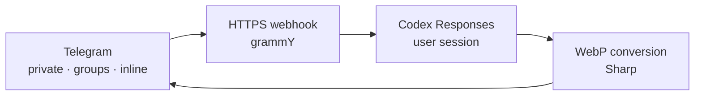

<div align="center">

# 🎨 StickerGen

**Turn an idea—or a photo—into a Telegram sticker using your own Codex account.**

[](https://t.me/stickergen_miramacho_bot)
[](https://nodejs.org/)
[](https://grammy.dev/)
[](https://www.docker.com/)
[](LICENSE.md)

### [🚀 Open @stickergen_miramacho_bot](https://t.me/stickergen_miramacho_bot)

</div>

StickerGen links each Telegram user to their own OpenAI/Codex session, generates images, and delivers them as Telegram-compatible static stickers. It works in private chats, groups, and inline mode—even when the bot is not a member of the chat.

> [!NOTE]
> This is an independent project. It is not affiliated with Telegram or OpenAI.

## ✨ What it can do

| | Feature |
| --- | --- |
| 🪄 | Create stickers from a text description |
| 📸 | Transform photos, image documents, and existing stickers |
| 🧑‍🎨 | Follow style instructions such as pixel art, comic, watercolor, or Paint |
| 🎛️ | Pick an optional one-use style preset from the private-chat interface |
| 📱 | Use a visual Telegram Mini App with uploads, style cards, live progress, and previews |
| 🫥 | Preserve the alpha channel when OpenAI returns real transparency |
| 👥 | Work in groups through commands, replies, and mentions |
| ⚡ | Generate in any chat with `@stickergen_miramacho_bot <prompt>` |
| 📊 | Follow generation through a live progress bar and ETA |
| 🧠 | Preserve the reply-chain context when refining generated stickers |
| 🔐 | Keep a separate encrypted Codex session for every user |
| 🧵 | Run multiple sticker generations concurrently |
| 🟢 | Receive a transparent PNG beside every sticker for WhatsApp's built-in sticker creator |
| 🐳 | Deploy as a single Docker service behind an HTTPS webhook |

## 💬 How to use it

Open [the bot](https://t.me/stickergen_miramacho_bot), run `/login`, and complete the Codex sign-in flow. You can then use:

| Action | Example |
| --- | --- |
| Create from text | `/sticker a waving astronaut raccoon` |
| Create conversationally | Send `a waving astronaut raccoon` in the private chat |
| Create from a photo | Send a photo with the caption `as an Advance Wars character` |
| Edit an image | Reply with `/edit add red sunglasses` |
| Restyle an existing sticker | Choose a preset, then send the static sticker in the private chat |
| Choose a one-use style | Use `/style` or tap **Choose style** |
| Invoke it in a group | Reply to an image with `@stickergen_miramacho_bot make it pixel art` |
| Check the linked account | `/whoami` |
| Remove the linked session | `/logout` |

### ⚡ Inline mode

Type this in any chat, even when StickerGen is not a member of the group:

```text
@stickergen_miramacho_bot an octopus programmer drinking coffee
```

Choose **Generate sticker** and the selected inline message starts generating automatically. Its ETA bar updates in place; only when the sticker is ready does a **Send sticker** button appear. That button opens a one-result inline picker containing the finished native sticker. Telegram requires the final sticker selection because inline messages cannot be edited into native stickers. Telegram does not provide the replied-to message in an inline query, so editing an image already posted in a chat requires the bot to be present and invoked through a mention or `/edit`.

Automatic inline starts require inline feedback to be enabled at 100% for the bot in BotFather. A short-lived **Starting…** callback remains attached to the initial result so Telegram supplies its editable inline message ID and so a delayed feedback update still has a manual fallback.

### 🎨 Style presets

In the private chat, use `/style` or the **Choose style** button to select a preset for the next sticker. Then send a text prompt, photo, or existing static sticker. The preset is consumed by that request and then automatically resets to **No preset**. A style explicitly written in the new prompt always takes priority over the selected preset, so free-form prompts remain fully supported.

The six initial presets range from a modern sticker treatment to classic print, animation, engraving, and Game Boy Advance-era artwork. Their order, button labels, descriptions, and prompt instructions all live in [`src/styles.json`](src/styles.json), making the catalog easy to revise without changing the selector code. Presets intentionally apply only to private-chat requests; groups and inline mode continue to use the style written directly in each prompt.

### 📱 Telegram Mini App

Use `/app`, the **Open StickerGen** button, or the bot's menu button to launch the visual studio inside Telegram. The Mini App supports a free-form prompt, the same JSON-defined style presets, PNG/JPG/WebP uploads, live SSE progress, and an in-app preview. The finished WebP is also sent to the user's private Telegram chat as a native sticker.

To restyle an existing static Telegram sticker, reply to it with `/app`, or send it directly to the bot without first selecting a one-use chat preset. StickerGen replies with **Edit in StickerGen** and creates a temporary in-process draft bound to that Telegram user and source message. The same `/app` reply flow also accepts Telegram photos and image documents. The Mini App can then display the exact source, apply a preset or free-form style, and reply to the original message. Drafts and generated previews expire after one hour and are not persisted or queued.

Every Mini App API request validates the signed `Telegram.WebApp.initData` server-side before using its Telegram user ID to load the existing encrypted Codex session. Uploaded image bytes, generated previews, draft file identifiers, and jobs remain in memory only. Several users and several requests from one user can generate concurrently.

## 🧠 How it works



Each request starts its own asynchronous generation, so several stickers can be generated concurrently, including multiple requests from the same user. StickerGen generates each request exactly once and does not crop subjects, remove backgrounds, or otherwise alter visual content locally. It only performs the technical conversion needed to satisfy Telegram's sticker limits. If OpenAI returns an image with transparency, the WebP output preserves its alpha channel; opaque images are sent as well.

In regular chats, every new bot message replies to the triggering message whenever Telegram provides one, and the generated sticker replies to the user's original request so concurrent results remain easy to match. StickerGen keeps a bounded index of the messages and Telegram image references it has seen. When a new request replies into an existing branch, the bot replays the available user and assistant turns—plus available source images—before the new prompt in the Codex request. This works in private chats, mentioned group threads, and Mini App drafts. Telegram inline mode does not expose an original chat message to reply to, so inline results continue through their placeholder flow without reconstructed chat context.

While a request is running, the bot updates a ten-block progress bar and an approximate ETA in the temporary status message. The initial 80-second estimate comes from observed production timings and can be configured with `GENERATION_ETA_MS`. Progress stops at 90% until Codex finishes because the upstream API does not report real completion percentages. In regular chats, Telegram also displays the **choosing a sticker** action until the job completes or fails.

Every generated sticker is followed by a lossless PNG export that preserves the generated alpha channel. Download it, then use **Stickers → Create** in WhatsApp and select the PNG. WhatsApp's official third-party pack API requires 3–30 stickers, so StickerGen deliberately uses WhatsApp's built-in one-at-a-time creator instead of fabricating a pack or requiring a separate sticker-maker app. Inline generations deliver this export to the user's private StickerGen chat because the bot may not belong to the destination chat.

## 🔐 Sessions and privacy

- Each Telegram user links their own account through the device-code flow.
- Tokens are stored as encrypted JWE values in `DATA_DIR/users.json`.
- Reply relationships, bounded message text, and Telegram image `file_id` references are stored in `DATA_DIR/conversations.json` for up to 30 days so edit context survives restarts. Image bytes are not stored there.
- When a reply branch is used for generation, its available text and referenced images are replayed through the requesting user's own Codex session.
- `SESSION_SECRET` must remain stable across restarts to preserve linked sessions.
- Images and credentials are never written to logs.
- Successful generation logs contain only the prompt, an identifier, and technical image statistics.
- Failed Codex calls emit a sanitized request/response trace for debugging. Tokens and account identifiers are redacted, while image payloads are replaced with their media type, size, and SHA-256 hash.

> [!IMPORTANT]
> Signing in with a ChatGPT/Codex account uses private Codex-compatible endpoints. They are not part of the public OpenAI API contract and may change without notice.

## 🛠️ Local development

### Requirements

- Node.js 22 or later
- A bot created with [@BotFather](https://t.me/BotFather)
- A public HTTPS URL for the webhook
- Inline mode enabled through BotFather's `/setinline` command

### Quick start

```bash
git clone https://github.com/victor141516/stickergen.git
cd stickergen
npm install
cp .env.example .env
npm start
```

Complete `.env` before starting the application:

| Variable | Purpose |
| --- | --- |
| `TELEGRAM_BOT_TOKEN` | Token issued by BotFather |
| `SESSION_SECRET` | Stable secret used to encrypt sessions |
| `PUBLIC_BASE_URL` | Public HTTPS origin for the webhook |
| `MINI_APP_URL` | HTTPS URL of the Mini App; defaults to `PUBLIC_BASE_URL/app` |
| `TELEGRAM_WEBHOOK_SECRET` | Secret used to authenticate Telegram webhook calls |
| `CODEX_MODEL` | Primary model that orchestrates image generation |
| `GENERATION_ETA_MS` | Initial generation estimate used by the progress bar |

Generate secrets with a cryptographically secure tool. Do not reuse the bot token as a session or webhook secret.

## 🧪 Verification

```bash
npm test
```

The test suite covers encrypted sessions, reply-thread reconstruction, multimodal Codex inputs, media handling, mentions, reply metadata, inline mode, SSE streaming, and WebP conversion for both transparent and opaque images.

The E2E script at `src/e2e-test.js` consumes a real generation and sends a sticker to the only stored user. Do not run it in CI or without explicit authorization.

## 🐳 Docker

```bash
docker compose build
docker compose up -d
```

The included Compose configuration connects the container to the external `caddywork` network, loads secrets from a file outside the repository, and exposes `/healthz` for monitoring. Adapt those paths and the network to your infrastructure. The original installation guide is available in [DEPLOY.md](DEPLOY.md).

## 🗂️ Project structure

```text
src/
├── auth.js       # Codex OAuth and JWE encryption
├── bot.js        # commands, mentions, inline mode, and jobs
├── codex.js      # Responses client and SSE parser
├── index.js      # HTTP server and Telegram webhook
├── miniapp.js    # Mini App HTTP API, SSE jobs, and static asset serving
├── miniapp-auth.js # Telegram initData signature validation
├── miniapp-drafts.js # temporary user-bound Telegram sticker drafts
├── stickers.js   # Telegram-compatible conversion
├── styles.js     # preset loading and prompt precedence
├── styles.json   # editable style catalog and button copy
└── store.js      # session storage
web/
├── index.html    # Mini App editor
├── app.js        # Telegram bridge and interactive workflow
└── styles.css    # responsive Telegram-themed interface
```

Development rules for assistants and contributors are documented in [AGENTS.md](AGENTS.md). StickerGen is available under the [MIT License](LICENSE.md).

---

<div align="center">

Made to turn “I just had a ridiculous idea” into a sticker before it stops being funny. 🫡

</div>
